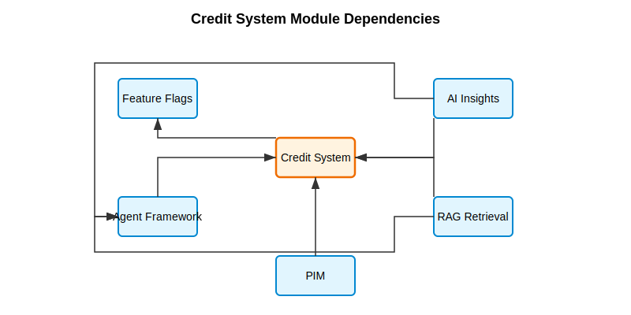

# ADR 0003: Credit System Architecture

## Status

Accepted

## Context

The Fluxori platform uses various AI models and services across multiple modules, including the Agent Framework, RAG Retrieval, and AI Insights modules. As these components are used more extensively, there is a need to track, manage, and optimize AI model usage to:

1. Maintain cost transparency and control
2. Enable different billing models for users and organizations
3. Prevent unexpected high costs or abuse
4. Optimize model selection based on cost-benefit analysis
5. Provide usage insights to users and administrators

We need a centralized, robust system that can:

- Track token usage across different AI models with varying pricing tiers
- Allocate and manage credits at organization and user levels
- Implement throttling and cut-off capabilities
- Optimize model selection based on cost and performance requirements
- Generate usage reports and analytics

## Decision

We will implement a Credit System Foundation module with the following architecture:

1. **Core Data Entities**:

   - CreditAllocation: Tracks credit allocations for organizations/users
   - CreditTransaction: Records credit additions and deductions
   - CreditUsageLog: Detailed log of AI operations and their token usage
   - CreditPricingTier: Defines pricing for different models and providers
   - CreditReservation: Enables pre-reserving credits for operations

2. **Core Services**:

   - CreditSystemService: Manages credit allocations, transactions, and reservations
   - TokenTrackingService: Integrates with the Agent Framework to track and estimate token usage

3. **Integration Strategy**:

   - Other modules will use the Credit System through well-defined public interfaces
   - Token tracking will hook into AI model calls with minimal performance impact
   - Adapter pattern will be used to integrate with Agent Framework and Feature Flags
   - Cache layers will be implemented for high-volume operations

4. **Architecture Principles**:
   - Strict module boundaries through public API defined in index.ts
   - Thread safety for concurrent credit operations
   - High-performance token tracking with minimal latency impact
   - Transactional credit operations to prevent race conditions
   - Comprehensive error handling for failure scenarios

## Implementation Details

1. **Credit Allocation Model**:

   - Support for subscription, pay-as-you-go, quota, and prepaid credit models
   - Organization and user-level allocations
   - Configurable expiration and reset periods

2. **Credit Reservation System**:

   - Pre-reserve credits for operations to ensure availability
   - Automatic cleanup of expired reservations
   - Transactional credit deduction upon operation completion

3. **Token Usage Tracking**:

   - Precise token counting for different models and operations
   - Integration with real pricing data from AI model providers
   - Support for different token types (input/output) with varying costs

4. **Model Cost Optimization**:

   - Select models based on complexity requirements and cost efficiency
   - Automatic fallback to less expensive models when appropriate
   - Integration with feature flags for enabling/disabling credit-intensive features

5. **Integration Points**:
   - Agent Framework: For token tracking and model selection optimization
   - Feature Flags: For controlling access to credit-intensive features
   - Observability: For monitoring and alerting on credit usage
   - Authentication: For user and organization identification

## Module Dependencies

The Credit System module has the following dependencies:

- Depends on Feature Flags module for toggling credit-intensive features
- Used by Agent Framework for token tracking and model optimization
- Used by AI Insights for credit consumption tracking
- Used by RAG Retrieval for token usage monitoring
- Used by PIM for AI-powered feature credit allocation

## Alternatives Considered

1. **Per-Module Credit Tracking**:

   - Each module could track its own token usage
   - Rejected due to code duplication, lack of centralized control, and complexity of cross-module reporting

2. **Direct Integration with Billing Systems**:

   - Bypassing credit abstraction and directly billing based on usage
   - Rejected due to lack of flexibility for different credit models and poor user experience

3. **Delegating Credit Management to External Service**:

   - Using a third-party service for credit management
   - Rejected due to high integration complexity and lack of fine-grained control

4. **Simple Rate Limiting Without Credits**:
   - Using simple rate limiting instead of a full credit system
   - Rejected as it doesn't provide the flexibility, transparency, or fine-grained control needed

## Consequences

### Positive

- Clear abstraction for token usage and costs across the platform
- Flexibility to support different credit models for various customer segments
- Reduced risk of unexpected costs from AI model usage
- Improved transparency for users regarding resource consumption
- Ability to optimize model selection based on cost constraints
- Foundation for advanced features like budget alerts and usage forecasting

### Negative

- Adds complexity to AI operation flow with additional checks
- Small performance overhead for token tracking
- Need to maintain pricing data for different models
- Potential for credit system failures to impact overall platform availability

### Risk Mitigation

- Implement fallback mechanisms if credit system is unavailable
- Design token tracking with minimal performance impact
- Set up comprehensive monitoring for the credit system
- Implement proper error handling and fallback strategies

## Implementation Plan

1. Phase 1: Core Credit System Foundation

   - Implement data models and repositories
   - Build core credit management services
   - Create integration points with Agent Framework

2. Phase 2: Optimization and Analytics

   - Implement model selection optimization
   - Build usage analytics and reporting
   - Add forecasting capabilities

3. Phase 3: User Experience and Administration
   - Create user interfaces for credit management
   - Implement alerts and notifications
   - Build administrative tools for credit allocation

## Related Documents

- [Agent Framework Architecture](./0001-module-boundary-enforcement.md)
- [Repository Pattern Implementation](./0002-repository-pattern-implementation.md)
