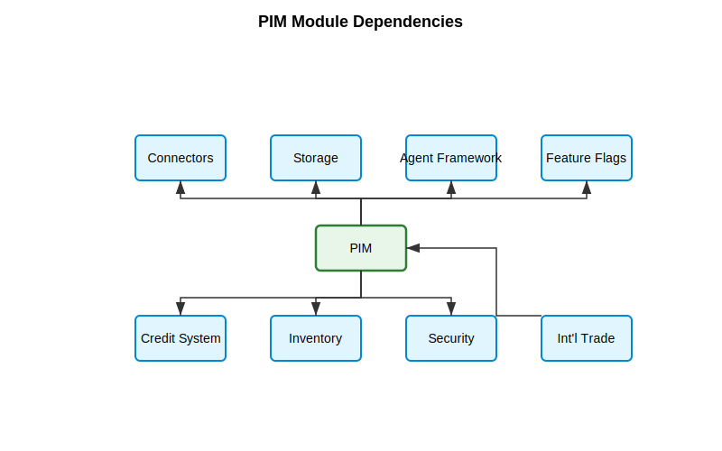

# ADR-006: PIM Module Implementation with Global Market Expansion

## Status

Proposed

## Date

2025-04-14

## Context

The Product Information Management (PIM) module is a critical component of the Fluxori e-commerce platform. While initially targeting South African e-commerce businesses, we have a clear roadmap to expand into broader African markets. This expansion strategy requires us to design our PIM module with global scalability in mind from the outset, while still prioritizing South African market optimizations for the initial launch.

The PIM module must follow the architectural principles defined in ADR-001 (Module Boundary Enforcement) and ADR-002 (Repository Pattern Implementation), and also address the specific challenges and requirements of each target market, beginning with South Africa's unique conditions such as load shedding, variable network connectivity, and local marketplace integration.

## Decision

We will implement the PIM module with a globally scalable architecture that prioritizes South African market optimizations initially, but is designed from the ground up to accommodate expansion into other African markets.

### Core Architecture Principles

1. **Market-Agnostic Core with Market-Specific Extensions**:
   - Implement a robust, market-agnostic core PIM functionality
   - Create a plugin architecture for market-specific features
   - Use feature flags to enable/disable market-specific functionality

2. **Internationalization by Design**:
   - Multi-currency support from day one
   - Localization infrastructure for all user-facing content
   - Flexible attribute system capable of handling region-specific requirements

3. **Modular Marketplace Connectors**:
   - Abstract marketplace integration interfaces
   - Market-specific connector implementations
   - Standardized synchronization protocols

4. **Progressive Enhancement for Varying Infrastructure**:
   - Base functionality works in constrained environments
   - Enhanced features activate when infrastructure permits
   - Graceful degradation when infrastructure is limited

### Required Functionality

The PIM module will implement the following comprehensive set of features:

#### Core PIM Functionality

**Product Management**
- Full CRUD operations for products
- Rich product data model with extensive attributes
- Product variants system with individual SKUs
- Product bundling with flexible pricing strategies
- CSV/JSON import and export functionality
- Bulk operations for multi-product editing
- Product filtering and search with performance optimization

**Category Management**
- Hierarchical category structure
- Category inheritance for attributes
- Category assignment for products
- Category-specific validation rules
- Category mapping to marketplace categories

**Attribute System**
- Dynamic attribute templates
- Attribute inheritance from categories
- Validation rules for attributes
- Attribute mapping to marketplace fields
- Custom attribute types (text, number, boolean, select, etc.)

**Media Management**
- Multi-image support for products
- Advanced image compression for variable bandwidth
- Image ordering and primary image selection
- Image upload with connection quality detection
- CDN integration for image delivery

#### Marketplace Integration

**Connector System**
- Unified marketplace integration API
- Support for Takealot (South African marketplace)
- Support for other South African marketplaces

**Synchronization**
- Bidirectional synchronization with marketplaces
- Conflict detection and resolution
- Validation before synchronization
- Marketplace-specific field mapping
- Error handling and retry mechanisms

**Marketplace-Specific Features**
- Takealot-specific categories and fields
- South African marketplace compliance fields
- Real-time validation against marketplace requirements
- Marketplace status monitoring
- Sync history and audit logs

#### AI-Powered Features

**Content Enhancement**
- AI-generated product descriptions
- AI-assisted SEO optimization
- Attribute extraction from product descriptions
- Image analysis for attribute detection
- Content translation and localization

**Categorization**
- AI-driven product classification
- Automatic category suggestion
- Confidence scoring for category matches
- Bulk classification API
- Category structure generation

**Price Intelligence**
- Dynamic pricing rules with formulas
- Competitive price monitoring
- Price recommendation engine
- Price history tracking
- Automated price adjustments

#### South African Market Optimizations

**Network Resilience**
- Variable connection quality detection
- Bandwidth-efficient operations
- Network-aware UI components
- Offline support with data synchronization
- Progressive loading for slow connections

**Load Shedding Resilience**
- Power outage detection and adaptation
- Operation queueing during outages
- Data caching for critical operations
- Automated recovery after power restoration
- Local storage with sync when power returns

**South African Compliance**
- 15% VAT handling and calculation
- South African regulatory field support
- ICASA/SABS/NRCS certification fields
- Import/export permit tracking
- South African province filtering

**Multi-Warehouse Support**
- Region-specific warehousing
- Stock level tracking across warehouses
- Regional fulfillment optimization
- Johannesburg/Cape Town/Durban warehouse support
- Stock movement tracking with audit trail

#### Inventory Integration

**Stock Management**
- Product stock levels across warehouses
- Stock movement history with audit trail
- Low stock monitoring and alerting
- Stock adjustments with reason tracking
- Multi-warehouse stock initialization

**Advanced Inventory Features**
- Network-aware stock operations
- Load shedding resilient stock management
- Stock allocation optimization
- Inventory reporting with bandwidth adaptation
- Inventory synchronization with marketplaces

#### Analytics and Reporting

**Product Analytics**
- Catalog completeness metrics
- Product performance tracking
- Data quality reports
- Attribute usage analysis
- Category distribution reports

**Export Capabilities**
- Multi-format exports (CSV, XLSX, PDF, JSON)
- Network-aware report generation
- Bandwidth-efficient export options
- Load shedding resilient exports
- Report bundling for efficiency

**Visualizations**
- Network-aware data visualizations
- Product performance dashboards
- Catalog health metrics
- Marketplace sync status dashboards
- South African market-specific analytics

#### Technical Implementation

**Architecture**
- Proper module boundaries (ADR-001)
- Repository pattern implementation (ADR-002)
- Service-controller structure
- Clear public API through index.ts
- Type-safe interfaces for all components

**Performance Optimization**
- Caching strategies for frequent operations
- Pagination for large data sets
- Cursor-based query optimization
- Lazy loading for related data
- Query execution optimization

**Error Handling**
- Comprehensive error management
- Network error resilience
- Graceful degradation during issues
- User-friendly error messages
- Error logging and monitoring

**Testing**
- Unit tests for core functionality
- Integration tests with mock marketplaces
- E2E testing for critical workflows
- Network condition testing
- Performance testing with large catalogs

**Documentation**
- User guides for all features
- API reference documentation
- Troubleshooting guides
- Implementation status tracking
- Module architecture documentation

**Cross-Module Integration**

**Module Dependencies**



The PIM module has the following key dependencies:
- Connectors Module for marketplace integration (Takealot, Bob Shop, Makro, etc.)
- Agent Framework Module for AI-powered features (product descriptions, image analysis)
- Credit System Module for AI usage tracking and allocation
- Feature Flags Module for market-specific feature toggling
- Storage Module for media management with network-aware capabilities
- Inventory Module for stock management and warehouse integration
- Security Module for data protection compliance and security features
- International Trade Module for cross-border trade functionality (bidirectional)

**Integration Patterns**
- Clear boundary enforcement
- Public API access only
- Event-driven communication
- Service-to-service integration
- Type-safe interfaces for all integrations

**User Experience Features**

**UI Components**
- Product management dashboard
- Category tree editor
- Attribute template manager
- Marketplace integration controls
- Inventory management interface
- Bulk editing tools
- Media management interface
- Advanced search and filtering

**Optimized Interactions**
- Network-aware form submissions
- Progressive enhancement based on connectivity
- Load shedding indicator and mode
- Offline capabilities for critical functions
- Bandwidth usage optimizations

### Module Structure

#### Core Components (Market-Agnostic)

**Controllers**
- ProductController
- CategoryController
- AttributeTemplateController
- ProductVariantController
- MediaController
- ImportExportController

**Services**
- ProductService
- CategoryService
- AttributeTemplateService
- ValidationService
- MediaService
- ImportExportService

**Repositories**
- ProductRepository
- CategoryRepository
- AttributeTemplateRepository
- ProductVariantRepository
- MediaRepository

**Models**
- Product
- Category
- AttributeTemplate
- ProductVariant
- ProductMedia
- PricingRule

#### Market-Specific Extensions

**South African Market (Priority 1)**
- LoadSheddingResilienceService
- NetworkAwareStorageService
- SouthAfricanVatService
- SouthAfricanMarketplaceConnectors (Takealot)
- SouthAfricanComplianceService (ICASA, SABS, NRCS)

**African Markets (Priority 2)**
- RegionalWarehouseService
- South African Marketplace Expansion
- RegionalComplianceService


### Implementation Approach

#### Phased Regional Rollout

1. **Phase 1: South African Market (Months 1-3)**
   - Comprehensive South African optimizations
   - Full Takealot marketplace integration
   - South African compliance fields
   - Load shedding and network resilience

2. **Phase 2: African Market Expansion (Months 4-6)**
   - Regional warehouse extensions
   - South African marketplace expansion
   - Country-specific tax handling
   - Cross-border trade features

#### Technical Implementation Strategy

1. **Abstraction Layers**
   - Create market-agnostic interfaces for all components
   - Implement market-specific adapters that conform to these interfaces
   - Use dependency injection to provide the right implementation based on market context

```typescript
// Market-agnostic interface
export interface VatService {
  calculateVat(price: number, productType: string, date?: Date): VatCalculation;
  removeVat(priceWithVat: number, productType: string, date?: Date): VatCalculation;
}

// South African implementation
@Injectable()
export class SouthAfricanVatService implements VatService {
  // Implementation for South African VAT rules
}

// Implementation for other African countries can follow the same pattern
```

2. **Market Context Provider**

```typescript
@Injectable()
export class MarketContextService {
  getMarketContext(organizationId: string): MarketContext {
    // Return market context (region, country, regulations, etc.)
  }
  
  isFeatureAvailable(feature: MarketFeature, context: MarketContext): boolean {
    // Determine if a market-specific feature is available in this context
  }
}
```

3. **Feature Flag Integration**

```typescript
@Injectable()
export class PimFeatureService {
  constructor(
    private featureFlagService: FeatureFlagService,
    private marketContextService: MarketContextService
  ) {}
  
  isMarketFeatureEnabled(feature: string, organizationId: string): boolean {
    const context = this.marketContextService.getMarketContext(organizationId);
    return this.featureFlagService.isEnabled(`pim.${context.region}.${feature}`, organizationId);
  }
}
```

### South African Optimizations (Initial Priority)

1. **Load Shedding Resilience**
   - Operation queueing during outages
   - Robust background processing with retry mechanisms
   - Client-side data persistence during outages
   - Automatic recovery and synchronization after power restoration
   - Scheduled operations during predictable power availability

2. **Network-Aware Components**
   - Bandwidth detection and adaptive responses
   - Progressive loading patterns for media and data
   - Compressed data transfers with configurable thresholds
   - Offline-first operations for critical functionality
   - Background synchronization strategies

3. **South African Marketplace Integration**
   - Takealot category and attribute mapping
   - South African pricing strategies (bundle discounts, promotional pricing)
   - Lead time optimization for local fulfillment
   - Local payment method integration

### Global Market Extensibility

1. **Multi-Region Data Model**
   - Products with region-specific attributes
   - Regional pricing and availability
   - Country-specific compliance fields
   - Region-based visibility controls

2. **International Marketplace Architecture**
   - Abstracted marketplace interface layer
   - Region-specific marketplace implementation
   - Standardized product transformation pipelines
   - Unified synchronization status tracking

3. **Global Compliance Framework**
   - Extensible compliance rule engine
   - Region-specific compliance validators
   - Compliance status visualization
   - Pre-submission validation for each target marketplace

4. **Centralized Tax Rate Service**
   - Database-driven tax rate management:
     - Country/region codes
     - Tax type (VAT, GST, etc.)
     - Current and future rates with effective dates
     - Historical rates for past transactions
     - Source references for audit purposes
   - Simple API for all modules to fetch rates:
     ```typescript
     const vatRate = await taxService.getCurrentRate({
       country: 'ZA', 
       taxType: 'VAT',
       transactionDate: new Date()
     });
     ```
   - Automatic handling of pending rate changes:
     - South Africa's announced VAT increases (15.5% from May 2025, 16% from April 2026)
     - System automatically applies correct rate based on transaction date
   - Admin interface for:
     - Managing tax rates across countries
     - Scheduling future rate changes when announced
     - Reviewing rate change history

## Centralized Business Rules Services

PIM functions would benefit from a centralized approach for business rules and configurable parameters. Implementing these as centralized services would create a unified administration experience, reduce technical debt by removing hard-coded values, enable history tracking for audit purposes, simplify versioning with effective dates, and improve resilience through graceful fallback to cached values during connectivity issues.

The following PIM functions are identified as candidates for this approach:

### 1. Currency Exchange Rates
- **Current challenge**: Manual updates for currency conversion rates
- **Centralized solution**: Exchange rate service with automatic updates from financial APIs
- **Benefits**: Accurate multi-currency pricing, historical rate tracking for reporting

### 2. Marketplace Requirements
- **Current challenge**: Hard-coded field mappings and validation rules for each marketplace
- **Centralized solution**: Configuration-driven marketplace requirement service
- **Benefits**: Easily update when Amazon/Takealot/etc. change their specifications without code changes

### 3. Product Classification and Categorization
- **Current challenge**: Static category trees and marketplace mappings
- **Centralized solution**: Dynamic category mapping service with admin interface
- **Benefits**: Update marketplace category mappings as they evolve, maintain consistent cross-marketplace categorization

### 4. Regulatory Compliance Rules
- **Current challenge**: Fixed compliance fields by product type
- **Centralized solution**: Compliance rule engine with configurable requirements
- **Benefits**: Add/modify South African regulatory requirements (ICASA/SABS/NRCS) as they change

### 5. Load Shedding Schedules
- **Current challenge**: Hard-coded load shedding handling
- **Centralized solution**: Configurable schedule service with regional variations
- **Benefits**: Adapt to South Africa's evolving power outage patterns across regions

### 6. Media Requirements
- **Current challenge**: Fixed image specifications
- **Centralized solution**: Configurable media requirement service
- **Benefits**: Update image size/format requirements as marketplaces change their specifications

### 7. Shipping and Location Data
- **Current challenge**: Static location and shipping zone definitions
- **Centralized solution**: Location management service with postal code mapping
- **Benefits**: Maintain accurate South African province mapping, add new fulfillment regions

### 8. Commission and Fee Structures
- **Current challenge**: Hard-coded marketplace fee calculations
- **Centralized solution**: Fee calculation service with rate tables
- **Benefits**: Update as marketplace commission structures change

### Business Rules Engine Pattern

Each of these services will follow a consistent pattern with:
- Database storage for configuration
- Version history with effective dates
- Admin UI for updates
- API access with caching
- Webhook capabilities for external updates

This approach will transform Fluxori from having brittle, hard-coded business rules to having a highly adaptable system that can evolve without code changes.

## Technical Implementation Details

### Module Registration with Regional Options

```typescript
@Module({})
export class PimModule {
  static register(options?: Partial<PimModuleOptions>): DynamicModule {
    const defaultOptions = {
      // Default options supporting global deployment
      defaultRegion: 'south-africa',
      enabledRegions: ['south-africa'],
      regionalOptimizations: {
        'south-africa': {
          enableLoadSheddingResilience: true,
          enableNetworkAwareComponents: true,
          enableVatManagement: true
        },
        'africa': {
          enableRegionalWarehousing: true,
          enableCrossBorderCompliance: true
        },
        'europe': {
          enableEuVatCompliance: false,
          enableCeMarkingValidation: false
        }
      },
      ...options
    };
    
    return {
      module: PimModule,
      imports: [/* dependencies */],
      controllers: [/* controllers */],
      providers: [
        // Core providers
        // Region-specific providers based on enabledRegions
        {
          provide: 'PIM_MODULE_OPTIONS',
          useValue: defaultOptions
        }
      ],
      exports: [/* exported components */]
    };
  }
}
```

### Regional Service Factory Pattern

```typescript
@Injectable()
export class VatServiceFactory {
  constructor(
    private southAfricanVatService: SouthAfricanVatService,
    private europeanVatService: EuropeanVatService,
    private marketContextService: MarketContextService
  ) {}

  getVatService(organizationId: string): VatService {
    const context = this.marketContextService.getMarketContext(organizationId);
    
    switch (context.region) {
      case 'south-africa':
        return this.southAfricanVatService;
      case 'europe':
        return this.europeanVatService;
      default:
        // Default implementation or throw error
        return this.southAfricanVatService;
    }
  }
}
```

## Implementation Phases and Timeline

### Phase 1: Core Infrastructure and South African Market (Months 1-3)

#### Month 1: Foundation
- Define all interfaces, models, and DTOs
- Create market abstraction layer
- Implement base repositories with South African focus
- Develop initial controller endpoints
- Implement Centralized Tax Rate Service with South African VAT handling

#### Month 2: South African Optimizations
- Implement network-aware components
- Add load shedding resilience
- Develop Takealot marketplace connector
- Create South African compliance validators

#### Month 3: Core PIM Features
- Complete CRUD operations for all entities
- Implement import/export functionality
- Add attribute system with validation
- Create category hierarchy management
- Develop product variant system

### Phase 2: African Expansion (Months 4-6)

#### Month 4: Infrastructure Expansion
- Implement regional warehouse support
- Add multi-currency pricing
- Develop cross-border trade features
- Extend Centralized Tax Rate Service for African countries

#### Month 5: South African Marketplace Expansion
- Expand Takealot integration capabilities
- Develop additional South African marketplace support
- Implement country-specific validation rules
- Create regional logistics optimizations

#### Month 6: Regional Optimizations
- Optimize for regional network conditions
- Implement mobile-first features for regions with high mobile usage
- Add regional payment method support
- Develop local language support


## Cross-Cutting Concerns

### Internationalization and Localization
- All user-facing text stored in translation files
- Culture-specific formatting for dates, numbers, and currencies
- Right-to-left (RTL) text support for future Middle Eastern expansion
- Region-specific terminology variations

### Performance Optimization
- Regional edge caching strategies
- Location-based request routing
- Market-specific performance benchmarks
- Bandwidth-adaptive content delivery

### Security and Compliance
- Region-specific data residency
- Compliance with local data protection regulations
- Market-specific product safety standards
- Regional payment security standards

### Testing Strategy
- Market-specific test suites
- Network condition simulation for each target region
- Load shedding simulation for South African market
- Performance testing under various regional conditions
- Compliance validation for each target marketplace

## Consequences

### Positive
- Scalable architecture capable of supporting global expansion
- Prioritized South African optimizations for initial launch
- Clear separation between core and market-specific functionality
- Flexibility to adapt to new markets with minimal core changes
- Strong typing and validation across all markets

### Challenges
- Increased complexity due to market abstraction layers
- Higher initial development overhead for market-agnostic components
- Need for extensive regional testing infrastructure
- Potential performance impact from additional abstraction layers

### Mitigation Strategies
- Feature flags to control functionality rollout by region
- Lazy loading of market-specific components
- Comprehensive automated testing for each market
- Performance benchmarking for each regional implementation

## Validation Approach
- Regular dependency graph analysis to ensure modularity
- Market-specific integration testing
- Simulated regional network and power conditions
- Marketplace connector validation for each target marketplace
- Performance benchmarking against regional user expectations

## Success Metrics
1. Product management performance under various regional conditions
2. Marketplace synchronization success rates by region
3. Time required to onboard new regional marketplaces
4. Regional API response times
5. Inventory accuracy across multiple marketplaces
6. Cross-region data consistency
7. User satisfaction metrics by region

## Alternatives Considered

### 1. Market-Specific Module Implementations
Creating entirely separate PIM modules for each market would provide maximum customization but would lead to significant code duplication and maintenance challenges.

### 2. South Africa Only with Future Refactoring
Building exclusively for South Africa with plans to refactor later would enable faster initial delivery but would likely result in significant rework during expansion.

### 3. Generic Global Implementation
Creating a generic implementation without market-specific optimizations would be simpler initially but would fail to address the unique challenges of the South African market for launch.

## Related ADRs
- [ADR-001: Module Boundary Enforcement](ADR-001-module-boundary-enforcement.md)
- [ADR-002: Repository Pattern Implementation](ADR-002-repository-pattern-implementation.md)